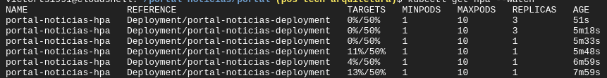

# sample-gke-hello-world

This is a project done during classes in the courses "KUBERNETES: PODS, SERVICES E CONFIGMAPS" and "KUBERNETES: DEPLOYMENTS, VOLUMES E ESCALABILIDADE" at Alura school.
I had the freedom to run this project on GKE and so the steps below for execution were written based on the GKE structure.

Below are the links to my course completion certificates:

[Certificate Link: KUBERNETES: PODS, SERVICES E CONFIGMAPS](https://cursos.alura.com.br/user/victorts1991/course/kubernetes-pods-services-configmap/certificate)

[Certificate Link: KUBERNETES: DEPLOYMENTS, VOLUMES E ESCALABILIDADE](https://cursos.alura.com.br/user/victorts1991/course/kubernetes-deployments-volumes-escalabilidade/certificate)

## How to Run

1. Copy and paste the folders listed below into the root of your GKE Cluster:
```sh
- db
- sistema
```

2. In the CLI of your GKE Cluster, execute the commands in sequence:
```sh
# Creating and exposing the database Deployment
cd db

# Creating the ConfigMap
kubectl apply -f db-configmap.yaml

# Creating the Deployment
kubectl apply -f db-noticias-deployment.yaml

# Creating the Load Balancer Service
kubectl apply -f svc-db-noticias.yaml

# Creating and exposing the Sistema StatefulSet
cd ../sistema

# Creating the ConfigMap
kubectl apply -f sistema-configmap.yaml

# Creating the PersistenceVolumeClaim at images
kubectl apply -f imagens-pvc.yaml

# Creating the PersistenceVolumeClaim at session
kubectl apply -f sessao-pvc.yaml

# Creating the StatefulSet
kubectl apply -f sistema-noticias-statefulset.yaml

# Creating the Load Balancer Service
kubectl apply -f svc-sistema-noticias.yaml
```

3. In the Services & Ingress menu, copy the IP from the Endpoints column of the svc-sistema-noticias

4. Paste the previously copied IP into the file portal/portal-configmap.yaml in the parameter value IP_SISTEMA, the code should look similar to the one below:
```sh
apiVersion: v1
kind: ConfigMap
metadata:
  name: portal-configmap
data:
  IP_SISTEMA: http://35.223.47.76
```

Obs: 
  - The IP prefix must be http:// and not https://;
  - Be careful when copying the IP with a slash at the end, leaving 35.223.47.76/, this slash at the end will result in the portal not being able to access the sistema-noticias pod API:

5. Copy and paste the portal folder into the root of your GKE Cluster;

6. In the CLI of your GKE Cluster, execute the commands in sequence:
```sh
# Creating and exposing the Portal Pod
cd portal

# Creating the ConfigMap
kubectl apply -f portal-configmap.yaml

# Creating the Deployment
kubectl apply -f portal-noticias-deployment.yaml

# Creating the Load Balancer Service
kubectl apply -f svc-portal-noticias.yaml
```

## How to Access

After all Pods and Services are running, perform the following steps to test:

1. In the GKE Services & Ingress menu, click on the IP in the Endpoints column of the svc-sistema-noticias service;
2. Enter the access data below to access:
```sh
- Username: admin
- Password: admin
```

3. Click on the blue "Nova Notícia" button;
4. Register a news item in the form within the modal that appears;
5. Back in GKE, in the Services & Ingress menu, click on the IP in the Endpoints column of the svc-portal-noticias;
6. A page will open displaying the news you previously registered;

## Implementing HorizontalPodAutoscaler

In the CLI of your GKE Cluster, execute the commands in sequence:
```sh
cd portal

kubectl apply -f portal-noticias-hpa.yaml

cd metric-server

# Metrics server downloaded from https://github.com/kubernetes-sigs/metrics-server/releases/latest/download/components.yaml
kubectl apply -f components.yaml
```

The metrics server may take a while to start collecting metrics for the HPA.

By executing the command below you will be able to check the current consumption through the "TARGET" column when the metrics server starts working.
```sh
kubectl get hpa --watch
```



## Testing HorizontalPodAutoscaler with the K6

1. Install K6 following the instructions in the link below:
```sh
https://k6.io/docs/get-started/installation/
```

2. Back in GKE, in the Services & Ingress menu, copy on the IP in the Endpoints column of the svc-portal-noticias;
3. In the portal/stress-test.js, paste the copied IP into variable URL, leaving the value with http:// in front;
4. Run the following command in GKE:
```sh
kubectl get hpa --watch
```

5. Run the command below in another CLI to see the HPA running
```sh
cd portal

k6 run stress-test.js
``` 
